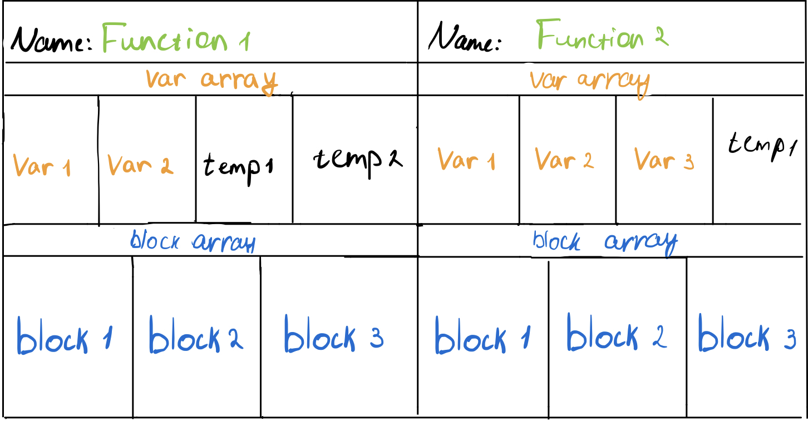
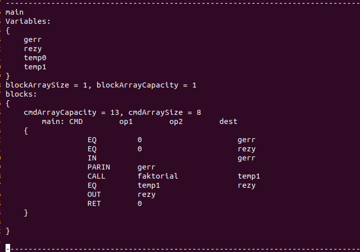

# Нативный компилятор
## Вступление
В этой работе будет написан компилятор для моего [языка программирования](https://github.com/lexain12/language). В языке программирования, написанным мною, использовался виртуальный процессор для исполнения файлов. Компилятор же сгенерирует нам файл, который можно исполнить на реальном процессоре. Скорость его исполнения мы сравним со скоростью на виртуальном процессоре.

## Цели работы
* Создать новый бекэнд для своего языка
* Создать исполняемый файл
* Сравнить скорости виртуального и реального процессора
## Frontend
В прошлом семестре я написал свой язык. Текстовый файл с синтаксисом моего языка представлялся в виде дерева, затем транслировался в написанный мной ассемблер. Далее, ассемблер исполняется на виртуальном процессоре.

В этом проекте, возьмем фронтэнд от нашего языка и напишем новый бекэнд.
## Промежуточное представление (IR)
После считывания языка в дерево, переводим его в промежуточное представление. Таким образом, будет удобнее оптимизировать код и затем транслировать его в бинарные команды.
Мое промежуточное представление имеет следующий вид:



1. Программа состоит из функций. Функция внутри себя содержит:

    * Название функции
    * Массив переменных
    * Массив блоков комманд

2. Каждый блок внутри себя содержит:
    * Название блока
    * Массив команд

3. Каждая команда состоит из:
    * Оператор 1
    * Оператор 2
    * Оператор 3 (Указатель на принимающую переменную)

Здесь операторы это тоже структура, которая содержит в себе тип данных, значение для каждого типа. В операторе может лежать число, указатель на переменную в массиве переменных и указатель на блок (в случае переходов).

Пример дампа промежуточного представления.



## Трансляция в бинарный файл (Backend)
На этом этапе нужно массив команд в каждой функции транслировать в команды процессора. Для начала, запишем все в буфер, а далее создадим простой ELF файл и запишем туда наш бинарный код. Ниже приведу примеры трансляции некоторых команд из моего промежуточного представления:

### Базовая арифметика
Строчка кода моего языка:

 ```z x tape y hp // z = x + y```

 Транслируется в промежуточное представление следующим образом:

```
    CMD     op1     op2     dest
    ADD     x       y       z
```
А в процессорные команды так:
```
    mov rax, [r9 - 8]  ; r9 pointer on buffer with vars. 8 - offset of x var
    mov rbx, [r9 - 16] ; 16 - offset of y var
    add rax, rbx
    mov [r9 - 24], rax
```
### Инициализация переменных
Строчка кода:
```
    var x 0 hp; // int x = 0
```
Представляется в промежутчном представлении:
```
    CMD     op1     op2    dest
    EQ       0       -      x
```
Транслируется в:
```
    mov [r9 - 8], 0
```
### Вызов функций
Вызов функции, представляющийся в промежуточном представлении:
```
    CMD     op1     op2     dest
    PARIN   a
    PARIN   b
    PARIN   c
    CALL    discriminant
```
Здесь PARIN это входные параметры для функции ```discriminant```

В команды транслируется:
```
    push [r9 - 8]
    push [r9 - 16]
    push [r9 - 24]
    call <rel address> //  В бинарном файле высчитывается относительно смещение
```
### Условные переходы
```
    right (1) // if (1)
    box       // {
    round     // }
    left      // else
    box       // {
    round     // }
```
В промежуточном представлении выглядит вот так:
```
    CMD     op1     op2     dest
    IF      IF0     ELSE0   1
```
Здесь `IF0`, `ELSE0` это название блоков, в которых стоит переходить в зависимости от условия.

Транслируется в:
```
    mov rax, 1
    cmp rax, 0
    jne IF0
    jmp ELSE0
```
## Тестирование производительности
В данном разделе я проведу сравнение скорости исполнения ELF файла и исполнения байт кода, сгенерированным моим фронтэндом, на виртуальном процессоре. В таблице приведенны результаты прогонки программы 100 раз.

Исполнитель | Время выполнения,мc | Коэфицент ускорения
| :---: | :---: | :---:
Виртуальный процессор | 0.139 | 1
Реальный процессор | 0.003 | 46.3

Как мы видим, скорость выполнения программы ускорилась в 46 раз.
## Вывод
В этом проекте был сделан компилятор для моего языка. После сравнения производительности мы убедились, что файл, который генерируется, исполняется быстрее.

## Cсылки
* https://github.com/lexain12/language
* https://cirosantilli.com/elf-hello-world#minimal-elf-file
